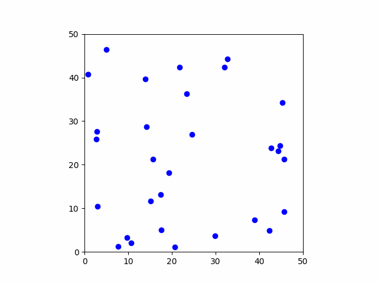
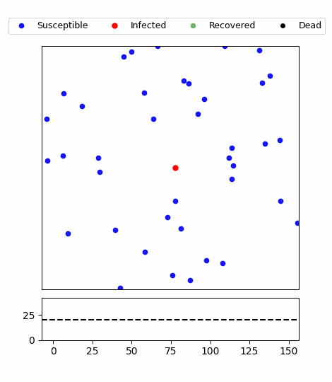

#### Multi-Agent-Experiments

#### E1 E2
Agentがボックス内を飛び回るシュミレーション
E2では感染症の蔓延をシュミレーションしている  
 

#### E3　
2体のAgentの会話シュミレーションの実装  
会話履歴すべてをプロンプトとしてAgentに与えている

- Todo
- 会話履歴以外の情報をmemoryに載せる
- Agentのペルソナの記載を増やす -> Done
- Agentが外部APIを使えるようにする -> Done
- ReActフレームワークの実装 -> Done エラーあり
→ E3-2で実装